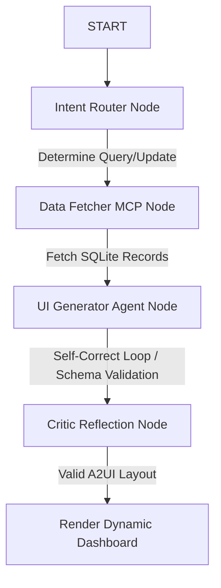

# A2UI Data Canvas - Sales Dashboard & Agentic IDE

An interactive, agentic sales dashboard canvas that utilizes Google's **Agent Development Kit (ADK)** and the **A2UI (Agent-to-User Interface) v0.9 Protocol** to dynamically generate and customize business dashboards using natural language.

Developed as a Capstone Project for the **AI Agents: Intensive Vibe Coding Course** by Google & Kaggle.

---

## 🎨 Project Overview

Standard business dashboards are static and require developer intervention to update layouts, add charts, or change queries. **A2UI Data Canvas** solves this problem by giving business users a conversational interface to query, edit, and visualize regional sales data dynamically. 

### Key Features
*   **Natural Language to Canvas (A2UI):** Users describe what they want to see (e.g., *"Compare North & South Q4 revenue"* or *"Show total sales by product category"*). The AI Agent translates this to SQLite SQL, queries the database, and dynamically designs a customized dashboard UI using the A2UI v0.9 Basic Catalog (Columns, Rows, Cards, Text, Buttons).
*   **Model Context Protocol (MCP) SQLite Integration:** Integrates with a local FastMCP sales data server exposing tools to query and update simulated sales data securely.
*   **Interactive Live SQLite Editor:** Edit records directly in a live data grid on the frontend dashboard. Changes are automatically updated in SQLite via MCP, and users can regenerate the canvas instantly to see the updated charts and metrics.
*   **Dynamic Chart Rendering:** Automatically aggregates query results and visualizes them in an interactive, animated bar chart synced with the canvas.
*   **Agentic Execution Trace Visualizer:** Shows the step-by-step timeline of the ADK Graph Workflow execution (`START` -> `Intent_Router` -> `Data_Fetcher` -> `UI_Generator_Agent` -> `Critic_Node`) in real-time.
*   **Premium Web UI Design:** Built with a clean, glassmorphic dark/light design system, Google Fonts (Inter & JetBrains Mono), smooth entrance animations, and helpful micro-interactions.

---

## 🏗️ Architecture

The backend utilizes an **ADK 2.0 Graph Workflow** (`sales_canvas_workflow`) to execute the agentic reasoning:



1.  **Intent Router (`Intent_Router`):** Analyzes the user prompt. If it detects an update command, it translates it to a SQL UPDATE and executes it.
2.  **Data Fetcher (`Data_Fetcher`):** Translates natural language queries to read-only SQL SELECT queries and fetches matching records from the SQLite database via MCP.
3.  **UI Generator (`UI_Generator_Agent`):** Reads the schema instructions and constructs a valid JSON object containing the raw data and the A2UI v0.9 component layout. It includes self-correction logic to retry up to 3 times if JSON or jsonschema validation fails.
4.  **Critic Reflection (`Critic_Node`):** Performs final semantic checks on the generated layout before delivering it to the user.

---

## 📁 Project Structure

```
a2ui-data-canvas/
├── app/                      # Backend Core
│   ├── agent.py              # Main ADK Graph Workflow and agent nodes
│   ├── fast_api_app.py       # FastAPI server with canvas APIs
│   └── app_utils/            # Telemetry & helper configs
├── canvas_dashboard/         # Frontend Web Client
│   └── index.html            # Single-page web dashboard with A2UI renderer
├── data/                     # Local SQLite DB
│   └── sales.db              # Pre-seeded sales database
├── tests/                    # Robust Test Suite
│   ├── unit/                 # Unit tests
│   ├── integration/          # SSE stream & integration tests
│   ├── eval/                 # Evaluation dataset & metrics config
│   └── test_a2ui.py          # Fast unit tests for layout validation
├── mcp_server.py             # FastMCP Sales Server (stdio transport)
├── pyproject.toml            # Project dependencies & pytest configuration
└── README.md                 # Project Documentation
```

---

## 🛠️ Installation & Setup

### Prerequisites
*   **Python:** Version `3.11` or `3.12`
*   **uv:** Python package manager (highly recommended) - [Install](https://docs.astral.sh/uv/getting-started/installation/)
*   **Google Gemini API Key:** Get an API key from [Google AI Studio](https://aistudio.google.com/)

### 1. Clone & Set Up Environment
Clone the repository:
```bash
git clone https://github.com/DoanNguyenDuyKha/Intensive-Vibe-Coding-Capstone-Project.git
cd Intensive-Vibe-Coding-Capstone-Project/a2ui-data-canvas
```

Create a `.env` file in the root directory and add your API key:
```ini
GEMINI_API_KEY=your_gemini_api_key_here
```

### 2. Install Dependencies
Install the required tools and dependencies using `uv`:
```bash
# Install ADK CLI tools (one-time setup)
uv tool install google-agents-cli

# Install dependencies using the project config
agents-cli install
```

---

## 🚀 Running the Project

### Start the Local Server
Run the FastAPI development environment:
```bash
agents-cli playground
```
Or start the FastAPI server directly:
```bash
uv run python app/fast_api_app.py
```

Open your browser and navigate to:
```
http://localhost:8000/canvas
```
You can now start entering queries (e.g., *"Show Q4 revenue"* or *"Update North sales category Software to revenue 400000"*) and interact with the canvas!

---

## 🧪 Testing

The codebase has unit, integration, and E2E coverage.

### Run All Tests
Execute pytest using `uv`:
```bash
uv run pytest tests/
```

### Run Fast Offline Unit Tests
Run the mock-patched unit tests for layout and validation:
```bash
uv run pytest tests/test_a2ui.py
```
*Note: The unit tests are completely mocked and run locally offline in ~2.5 seconds without making external Gemini API calls.*

---

## 📊 Evaluation Loop

The project is configured for automated agent evaluation under the `tests/eval/` directory.

To run evaluation tasks, grade outputs, and analyze metrics:
```bash
# Generate evaluation trace data
agents-cli eval generate

# Grade the generated traces
agents-cli eval grade
```
The custom evaluation metrics (`visual_behavioral_correctness` and `intent_satisfaction`) are configured in `tests/eval/eval_config.yaml`.
