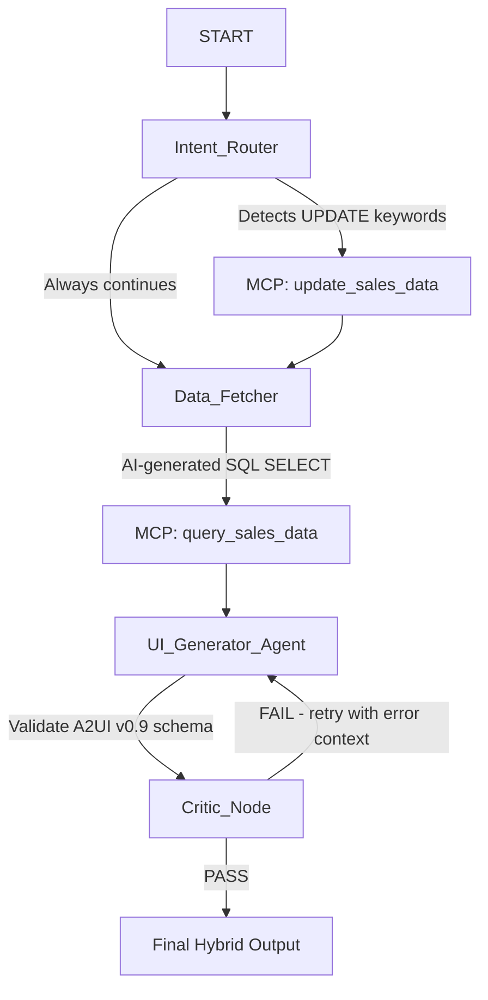

# ?? A2UI Data Canvas — Agentic Sales Intelligence Dashboard

> **AI Agents: Intensive Vibe Coding Capstone Project** — Google & Kaggle
> **Competition Track:** ?? Agents for Business
> **Author:** DoanNguyenDuyKha

[](https://google.github.io/adk-docs/)
[](https://pypi.org/project/a2ui-agent-sdk/)
[](https://github.com/modelcontextprotocol)
[](https://python.org)
[](#testing)

---

## ?? Demo Video

**[Watch the 5-Minute Demo on YouTube](https://youtu.be/IU5HIEICL4g?si=dFYRvhyQGj0yG8da)**


---

## ?? Problem Statement

Standard business dashboards are **static, rigid, and developer-dependent**. Updating a query, changing a chart type, or drilling into a region requires a developer to modify code, redeploy, and wait — a process taking hours or days.

**A2UI Data Canvas solves this** by giving business analysts a conversational AI interface to:
- Ask any data question in natural language
- Get a fully customized, interactive multi-card dashboard rendered instantly
- Update records directly through conversation
- See the agentic reasoning process step-by-step in real time

### Why an Agent-Based Approach?

A single LLM call cannot reliably handle all steps: understanding intent, constructing SQL, validating results, designing a multi-card layout, and self-correcting on schema errors. The **ADK Graph Workflow** decomposes this into specialized, accountable nodes — enabling self-correction loops, MCP tool integration, and schema-validated output.

---

## Course Concepts Demonstrated (5 of 5+)

| # | Course Concept | Implementation |
|---|---|---|
| 1 | **Multi-Agent Graph Workflow (ADK 2.0)** | 4-node `sales_canvas_workflow`: Intent Router, Data Fetcher, UI Generator, Critic |
| 2 | **Model Context Protocol (MCP) Server** | FastMCP `mcp_server.py` exposing typed SQLite read/write tools with permission isolation |
| 3 | **Agent-to-UI Protocol (A2UI v0.9)** | Schema-validated dynamic dashboard generation using A2UI Basic Catalog |
| 4 | **Self-Correction Reflection Loop** | UI Generator retries up to 3x, feeding jsonschema validation errors back as prompt context |
| 5 | **Agentic Security and Guardrails** | SQL injection prevention, read-only tool isolation, credential-free deployment |

---

## Key Features

- **Natural Language to Dashboard:** Type any business question and get a multi-card dashboard instantly
- **Smart Chart Selection:** AI picks bar (rankings), line (trends), or pie/donut (distributions) automatically
- **Live Database Editing:** Edit sales records in-browser; changes persist via MCP and dashboard auto-refreshes
- **Agentic Execution Trace:** Real-time step-by-step timeline of the Graph Workflow execution
- **Premium Animated UI:** Spring-physics card animations, blossoming SVG charts, staggered progress bars
- **PDF Export:** Print-optimized report with solid-color SVG charts
- **Drill-Down Navigation:** Region buttons auto-submit follow-up analysis queries

---

## Architecture

### System Overview

```
Browser Client (index.html)
  Prompt Input ? FastAPI /run_sse ? ADK Graph Workflow
  Canvas Render ? SSE Events ? Critic_Node output
  Trace Timeline ? SSE Events ? node execution events

ADK 2.0 Graph Workflow:
  START
    ? Intent_Router  (detect UPDATE vs SELECT intent)
    ? Data_Fetcher   (NL?SQL via Gemini, execute via MCP read tool)
    ? UI_Generator   (A2UI v0.9 JSON layout, 3x self-correction loop)
    ? Critic_Node    (final jsonschema validation gate)
    ? Final Output

MCP Server (mcp_server.py, stdio transport):
  query_sales_data(sql)   ? SELECT only, read isolation
  update_sales_data(sql)  ? UPDATE/INSERT only, write isolation
  SQLite: data/sales.db
```

### ADK Graph Workflow — Node Details



| Node | Role | Key Design Decision |
|---|---|---|
| **Intent_Router** | Detect UPDATE vs SELECT intent | Keyword matching plus LLM SQL translation; avoids full-agent call for simple updates |
| **Data_Fetcher** | Translate NL to SQL, execute via MCP | Detailed SQL rules in system prompt prevent hallucinated column names; MCP read isolation prevents destructive queries |
| **UI_Generator_Agent** | Generate A2UI v0.9 JSON dashboard | Schema-constrained JSON output plus 3-attempt self-correction eliminates invalid layouts |
| **Critic_Node** | Final semantic validation gate | Lightweight jsonschema circuit breaker before returning output to client |

---

## Safety and Guardrails

| Threat | Mitigation |
|---|---|
| **SQL Injection** | MCP `query_sales_data` blocks any non-SELECT statement; only SELECT is permitted |
| **Destructive Queries** | Read and write tools are separate MCP tools with separate node-level permissions |
| **API Key Leakage** | `GEMINI_API_KEY` stored only in `.env` (gitignored); repo contains `.env.example` with placeholder |
| **Hallucinated Data** | A2UI jsonschema validator validates every generated layout before it reaches the frontend |
| **Invalid Schema Output** | 3-attempt self-correction: validation errors fed back as structured LLM context |
| **Prompt Injection** | User prompts are user-turn content only; system prompt is static and controlled |

---

## Project Structure

```
a2ui-data-canvas/
+-- app/
¦   +-- agent.py              # ADK Graph Workflow and all 4 agent nodes
¦   +-- fast_api_app.py       # FastAPI server with /run_sse, /api/canvas endpoints
+-- canvas_dashboard/
¦   +-- index.html            # Single-page dashboard: A2UI renderer plus chart engine
+-- data/
¦   +-- sales.db              # Pre-seeded SQLite database (Q3/Q4 regional sales)
+-- tests/
¦   +-- unit/                 # Unit tests (offline, mocked, ~2.5 seconds)
¦   +-- integration/          # E2E SSE stream integration tests
¦   +-- test_a2ui.py          # A2UI schema validation tests
+-- mcp_server.py             # FastMCP SQLite Server (stdio transport)
+-- pyproject.toml            # Dependencies, pytest config, project metadata
+-- README.md                 # This file
```

---

## Installation and Setup

### Prerequisites
- Python 3.11 or higher
- uv package manager — https://docs.astral.sh/uv/getting-started/installation/
- Google Gemini API Key — https://aistudio.google.com/

### 1. Clone the Repository

```bash
git clone https://github.com/DoanNguyenDuyKha/Intensive-Vibe-Coding-Capstone-Project.git
cd Intensive-Vibe-Coding-Capstone-Project/a2ui-data-canvas
```

### 2. Configure API Key

Create a `.env` file in the project root:

```ini
GEMINI_API_KEY=your_gemini_api_key_here
```

> Never commit your API key. The `.env` file is gitignored.

### 3. Install Dependencies

```bash
uv tool install google-agents-cli
agents-cli install
```

---

## Running the Project

```bash
# Option A: Using agents-cli
agents-cli playground

# Option B: Direct FastAPI server
uv run python app/fast_api_app.py
```

Open your browser: **http://localhost:8000/canvas**

### Example Queries

```
"Who has the highest total revenue?"
"Compare Q3 vs Q4 revenue by product category"
"Show monthly revenue trend for Software"
"Revenue breakdown by region — which region leads?"
"Update North Q4 Software revenue to 300000"
```

---

## Testing

```bash
# Run all 7 tests
uv run pytest

# Run fast offline tests only (~2.5 seconds, no API calls)
uv run pytest tests/test_a2ui.py tests/unit/
```

**Result: 7/7 passed**

| Test Suite | Type | Notes |
|---|---|---|
| `tests/unit/` | Unit | Mocked, offline |
| `tests/integration/test_agent.py` | Integration | Live Gemini API |
| `tests/integration/test_server_e2e.py` | E2E | Live server |
| `tests/test_a2ui.py` | Schema validation | Mocked, offline |

---

## Evaluation

```bash
agents-cli eval generate
agents-cli eval grade
```

Custom metrics in `tests/eval/eval_config.yaml`:
- `visual_behavioral_correctness` — Does the rendered dashboard match user intent?
- `intent_satisfaction` — Does the SQL query accurately address the question?

---

## Future Improvements

| Feature | Description |
|---|---|
| **Cloud Deployment** | Deploy to Google Cloud Run via `agents-cli deploy` |
| **Multi-Database Support** | Connect to BigQuery, Cloud SQL, or AlloyDB via additional MCP servers |
| **Voice Input** | Integrate Gemini Live API for voice-to-dashboard |
| **Collaborative Canvas** | Real-time multi-user dashboard editing via WebSocket |
| **Automated Reporting** | Scheduled report generation and email delivery |
| **Vertex AI Integration** | Enterprise-grade security and audit logging |

---

## License

Licensed under the [Apache License 2.0](LICENSE).

---

## Acknowledgments

- **Google and Kaggle** — for the AI Agents: Intensive Vibe Coding Course
- **Google ADK Team** — for the Agent Development Kit 2.0
- **A2UI Team** — for the Agent-to-UI Protocol v0.9
- **FastMCP** — for the MCP server framework


